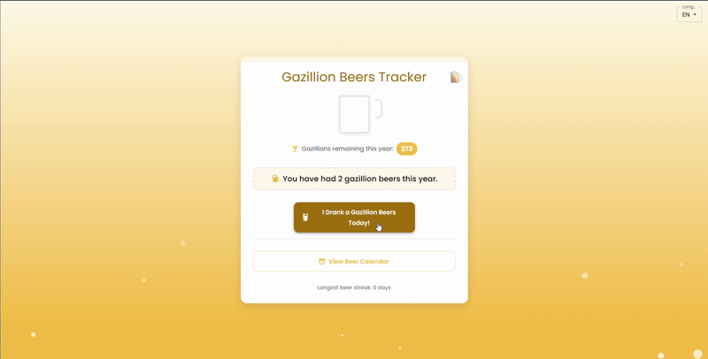

<kbd>[](README.pt_br.md)</kbd>

# Gazillion Beers Project

Proclaim your daily gazillion beers in one click, tracked all year by a trusty cookie—no double-dips allowed!



## 🍻 Live Demo

Check out the live version of the app at [gazillion-beers.rubrion.com](https://gazillion-beers.rubrion.com)

---

## How to Run Locally

1. Clone the repository:

   ```bash
   git clone https://github.com/rubenszinho/gazillion-beers.git
   cd gazillion-beers
   ```

2. Install dependencies:

   ```bash
   npm install
   ```

3. Start the development server:
   ```bash
   npm run dev
   ```

---

## Note for Contributors

To add a new language:

1. Create a file in `src/languages/` using a [language tag](https://developer.mozilla.org/en-US/docs/Web/API/Navigator/language) (e.g., `fr.ts`, `es.ts`).
2. Export a translation object containing all required keys (titles, messages, etc.).
3. Register the file in `src/languages/index.ts`.
4. The new language will automatically appear in the dropdown.

## Features

- 🍺 Track daily beer check-ins with a single click
- 📅 Calendar view of all your beer days
- 🔥 Streak tracking for consecutive beer days
- 🌐 Multi-language support
- 📱 Responsive design works on all devices

### Support the Project 🥳

Love the Gazillion Beers? Support me to buy the next gazillion beers ! 🍻

[](https://www.paypal.com/donate/?hosted_button_id=KBPKKS3627FX6)
