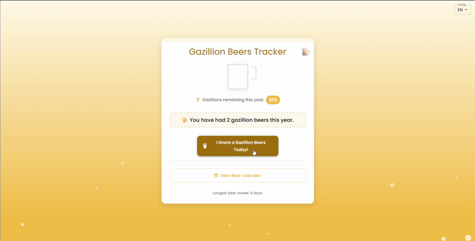

# Gazilhões de Cerveja

Proclame seus gazilhões diários de cerveja com um clique, acompanhados o ano todo por um confiável cookie—sem repetições permitidas!



## 🍻 Demonstração

Confira a versão ao vivo do aplicativo em [gazillion-beers.rubrion.com](https://gazillion-beers.rubrion.com)

---

## Como Rodar Localmente

1. Clone o repositório:

   ```bash
   git clone https://github.com/rubenszinho/gazillion-beers.git
   cd gazillion-beers
   ```

2. Instale as dependências:

   ```bash
   npm install
   ```

3. Inicie o servidor de desenvolvimento:
   ```bash
   npm run dev
   ```

---

## Nota para Contribuidores

Para adicionar um novo idioma:

1. Crie um arquivo em `src/languages/` usando uma [tag de idioma](https://developer.mozilla.org/en-US/docs/Web/API/Navigator/language) (ex.: `fr.ts`, `es.ts`).
2. Exporte um objeto de tradução contendo todas as chaves necessárias (títulos, mensagens, etc.).
3. Registre o arquivo em `src/languages/index.ts`.
4. O novo idioma será exibido automaticamente no dropdown.

## Funcionalidades

- 🍺 Registre seus gazilhões de cerveja com um único clique
- 📅 Visualize um calendário com todos os seus dias de cerveja
- 🔥 Acompanhe sequências de dias consecutivos
- 🌐 Suporte a múltiplos idiomas
- 📱 Design responsivo para todos os dispositivos

### Apoie o Projeto 🥳

Ama o Gazillion Beers? Me ajude a tomar meu próximo gazilhão de cerveja! 🍻

[](https://www.paypal.com/donate/?hosted_button_id=KBPKKS3627FX6)
